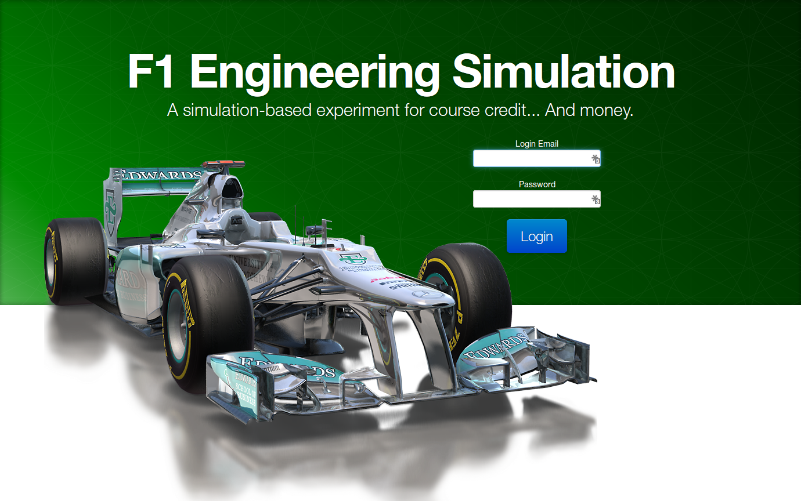
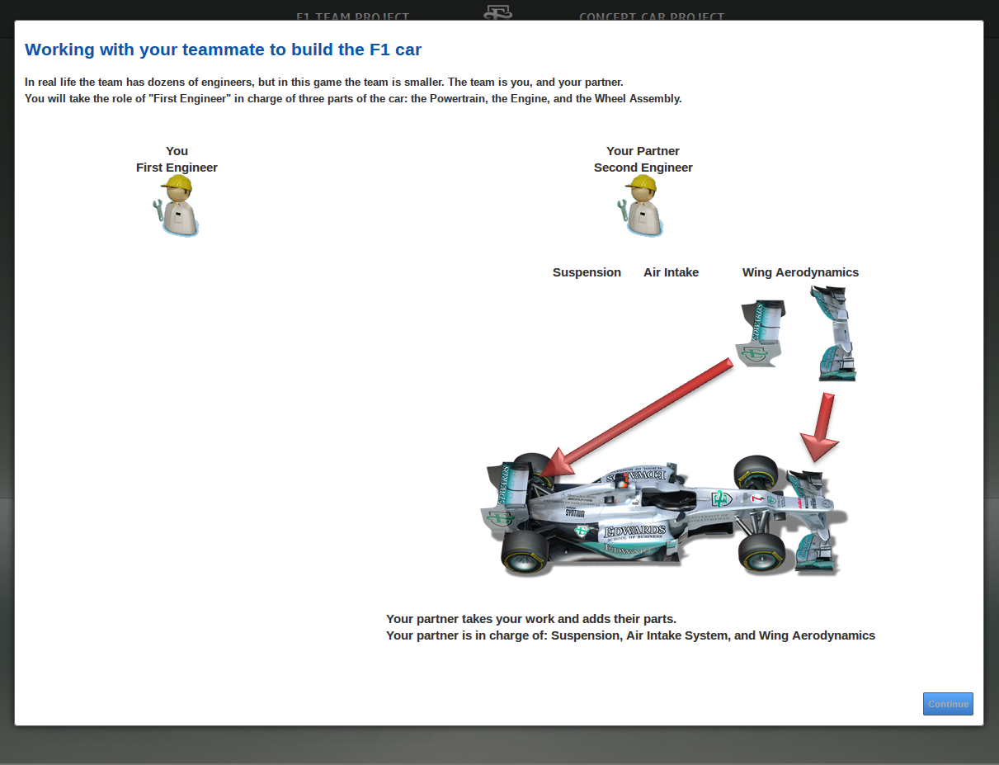
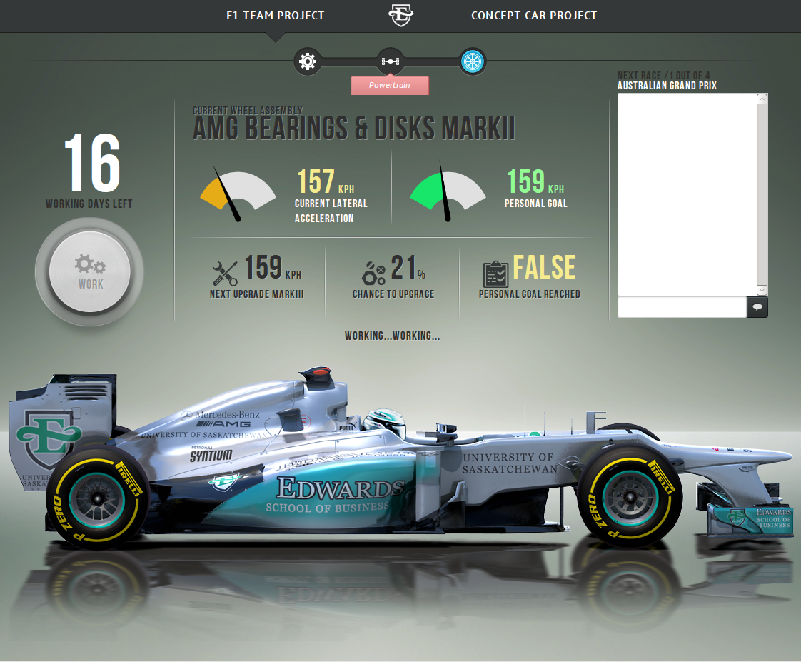
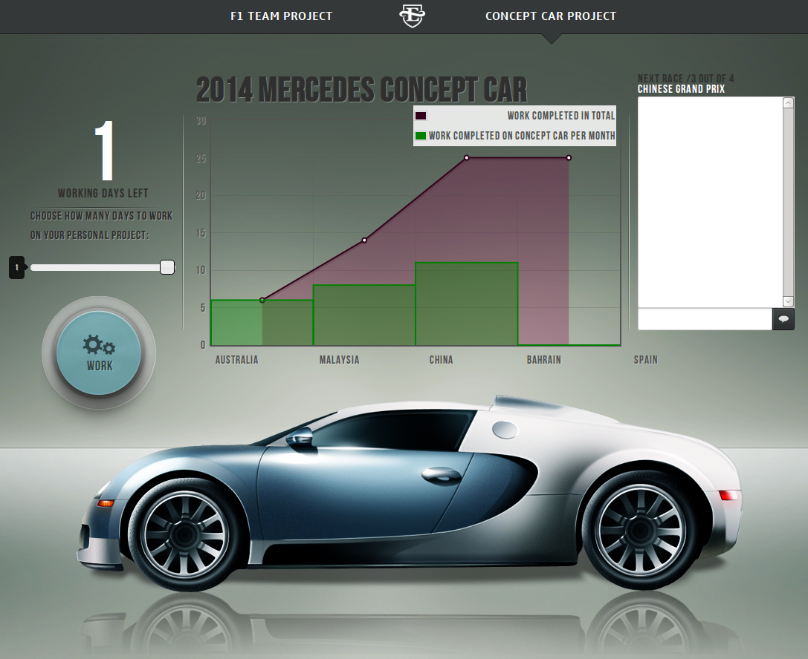
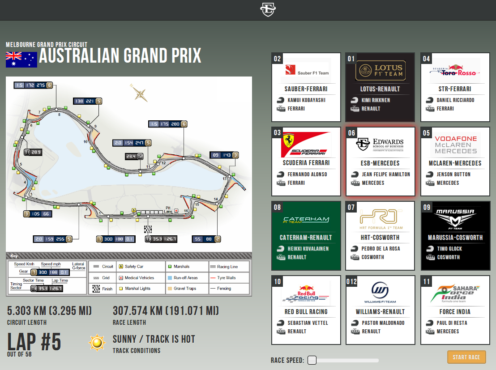
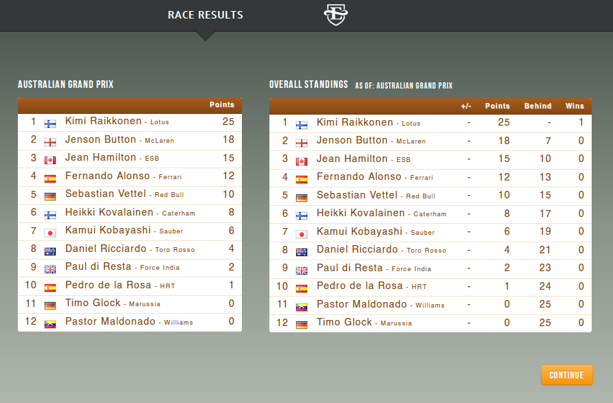
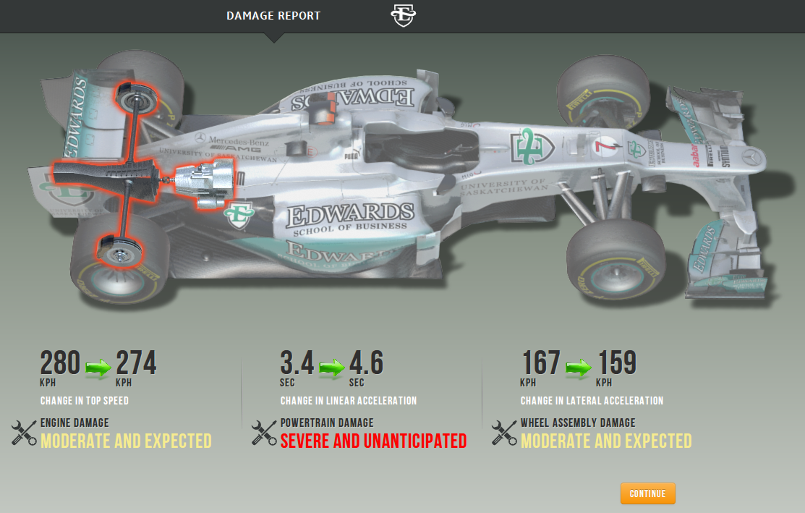

# Simulation Experiment System

## Overview

This is a multiplayer real-time computer-based simulation, similar to a Formula-1 manager sim. 

[Technical Specs](#technical-specs) | [Features](#features) | [Screenshots](#screenshots) | [Installation Instructions](#installation-instructions)

Underneath the game-like exterior, it's an experiment server that I've used to test hypotheses about power, dependence, and [Self Determination Theory](http://selfdeterminationtheory.org/). The idea is:
 - Have many participants sit down in a lab 
 - Participants are randomly and anonymously assigned an experimental condition 
 - Two of these participants (A and B) take on the role of Engineer A and Engineer B in a Formula 1 race car team 
 - Their job is to work together to improve their car and race it against other cars
 - There are 8 races in all. 
 - Those who get the most points in the races will win a cash prize at the end of the experiment (usually $20-$50).

For my particular experiments, I was studying the effects of task dependence, power, and the sense of obligation and internalized motivation these produced. For example, after 4 races participant B's work increased. If B did not request that A do more work, B would not be able to complete their assigned work. So B asked A to help. 

- How did that affect A? 
- Did A feel pressure to help B? 
- Did A feel a sense of power over B? 
- Did A begin to internalize B's task as part of their own? 
- Etc.

#### Published in:

Poile, C. (2017). Power is as Power Does: Exploring the Paradox of Resource Control Between Coworkers. In Academy of Management Annual Meeting. Atlanta, GA, August 4-8. http://doi.org/10.5465/AMBPP.2017.17733abstract

(And elaborated on in:)

Poile, C. (2017). Why would I help my coworker? Exploring asymmetric task dependence and the Self-determination Theory internalization process. Journal of Experimental Psychology: Applied, 23(3), 354-368. http://doi.org/10.1037/xap0000128

Poile, C. (2018). When Power Hurts: Task-dependent Resource Control Creates Temporary Discomfort that Motivates Helping Behaviour. Canadian Journal of Administrative Sciences / Revue Canadienne Des Sciences de l'Administration. http://doi.org/10.1002/cjas.1499

## Technical Specs

- Scala for the core simulation (~12600 LOC)
- Akka for the game-runner simulation, chat, lobby, and administrator UI/console
- Java for Vaadin and the GWT components (~1000 LOC)
- Javascript (using JQuery) for the frontend (unsure of LOC)
- Capacity: the server has handled 200 participants at a time. Not sure how many more it can handle; it's never been load tested
- Robust: can handle participant reconnections without ruining the pair's session (eg, accidentally hitting the browser back button or closing the window)

## Features

### Pre-simulation
- Randomized assignment of participants into experimental conditions (changeable in the configuration files)
- Participants are balanced across conditions
- Conditions can include the participants physical location (eg, students in Lab 1 should only be paired with students in Lab 2)
- Conditions can vary the amount of work each role needs to do, the rewards, the difficulty in achieving their goals, etc.
- A waiting lobby with background reading and dynamically updated counter showing how many participants are also waiting and when the experiment will begin
- A step-by-step interactive tutorial giving the background and rules of the Formula 1 engineering simulation "game" the participant is playing
- A one sample/training round for the participant to try out to make sure he/she understands the instructions
- Control questions to ensure the participant understands the experiment, their goals, and the reward condition
- An administration UI that the experimenter can log into from their own computer where they can see the status of every participant, the stage of the tutorial they are in, when they are ready to begin the "game"

### During simulation
- In the admin UI, the experimenter can see every participants behavior and the stage of the "game" they are in. This lets you identify anyone who is stuck (so you can go over and help them personally).
- A mondodb database stores the data
- Optional chat between participants (recorded for later analysis)
- All decisions made by participants are recorded and timestamped for analysis

### Extra data collection (eg, surveys)
- Questions can be given after any particular round, and after the experiment is finished 
- The survey can be given inside the simulation software or the participant can be sent to an outside survey tool (I used the university's SurveyMonkey)
- If the participant skips the survey, or accidentally exits before finishing, participant will be sent to the survey again
- Only participants who complete the surveys will be marked as "completed" on the internal database
- External data is connected to internal data through UUIDs, and can be joined for data analysis
- Data can be anonymous (if the internal database does not keep identifying information, such as student ids)  

## Screenshots

### Splash screen / Login

- Setting a professional experimental tone is crucial to making participants take the experiment seriously. 
- The physical space is important as well; Styrofoam dividers are/should be placed between computers in the lab.
- This helped prevent accidentally breaking anonymity, and it reinforced the experimental realism.

### Step-by-step tutorial

- A step by step tutorial using animation and participation was designed to help ease the participants into the task. 
- The tutorial was designed to be similar to those found in video games. 
- It walked participants through each aspect of the simulation, allowing them to take all the actions and visit all the screens they would encounter in the full simulation.

### Main simulation 'game' screen 

- The main screen was designed to present just enough information to give the task a concrete and tangible effect on the car and their partner’s job. 
- The participant was intended to focus on the task and their partner’s dependency, but ultimately was constrained to only 2 actions: work on the F1 project (help), work on the concept car project (not help).

### The personal project competing for Role A's attention

This was the personal project competing for Role A’s attention. 
- Participants taking Role A needed to decide how much time they would spend out of the month on the F1 car vs the concept car. 
- Role A’s managers valued the time spent on the concept car; the more work done on the concept car, the more likely Role A would receive the $50 reward. 
- But without Role A’s work on the F1 car, Role B would not be able to finish their parts of the F1 car, and the car would do poorly in that month’s upcoming race. 
- Role B’s managers would reward the Role B who had the highest ranking after the 4 months of racing with $50.

### The Race

- The team’s car would finish based on how much work the team was able to complete. 
- As the laps completed, the cards representing each team would slide into their respective positions for that lap. 
- The track conditions were just for fun (and realism).

### Race results

- The race results reinforce the consequences of the decision Role A made to help/not help their partner. 
- Role A will see that their actions affect something tangible, and Role B sees their chances of winning in a visible ranking.

### Damage screen

- This screen’s only purpose is to reinforce the realism of the simulation; the numbers do indeed change based on the damage, but the math is set up such that the damage has no impact on the amount of work the team needs to do in the next round.

# Note on code quality and Design

Originally, this was not coded for other people. I'm open-sourcing it just to see if anyone else can get some use out of the months of work I put into it. I apologize for the how messy the code is. 

I started using Vaadin, because it seemed like a quick way of getting it done. But I ended up having to customize it so heavily for the Javascript frontend that I should have used some other single page webapp framework (at the time I probably should have used Backbone and Knockout.js). If I did it again today, it would be a perfect use case for React.js and Go on the backend. 

# Installation Instructions

Instructions for OSX with homebrew
- Install JDK
  - We're using Scala 2.10.4, so we need Java 8
  - `brew tap caskroom/versions`
  - `brew cask install java8`
  - `brew install jenv`
  - Add to .bashrc:

        export JENV_ROOT="/usr/local/Cellar/jenv/"
        if which jenv > /dev/null; 
           then eval "$(jenv init -)"; 
        fi

   - `/usr/libexec/java_home -V`
   - Then run `jenv add <dir>` for each jdk you want use from the last command
   - `jenv global 1.8`
- Install Maven
  - `brew install maven`
- Install Scala
  - `brew install scala@210`
  - `echo 'export PATH="/usr/local/opt/scala@2.10/bin:$PATH"' >> ~/.bash_profile`
- Install mongodb in a docker container:
  - Install docker, then:
  - `docker run -d -p 27017:27017 --name mongo mongo:2.6.12`
- Build the server
  - `cd` to the experiment server root directory
  - `mvn clean install`
  - `mvn -pl simulation jetty:run`
  - Point your browser to `localhost:8092`
  - Do this in another tab to get two players
- The experiment server's configuration settings are in: `experiment-server/simulation/src/main/config/application.conf`
  - I would recommend starting with uncommenting all the testing settings (lines 54-69) (setting them to true) which will allow you to see the whole game.
   - Then re-comment, and play around with the server to learn how it works. 
- I will have to write a real tutorial if anyone wants to use this in their own experiments. It is very un-user friendly (to the person setting up the experiment) and it basically assumes you know java/scala. 
	
		
